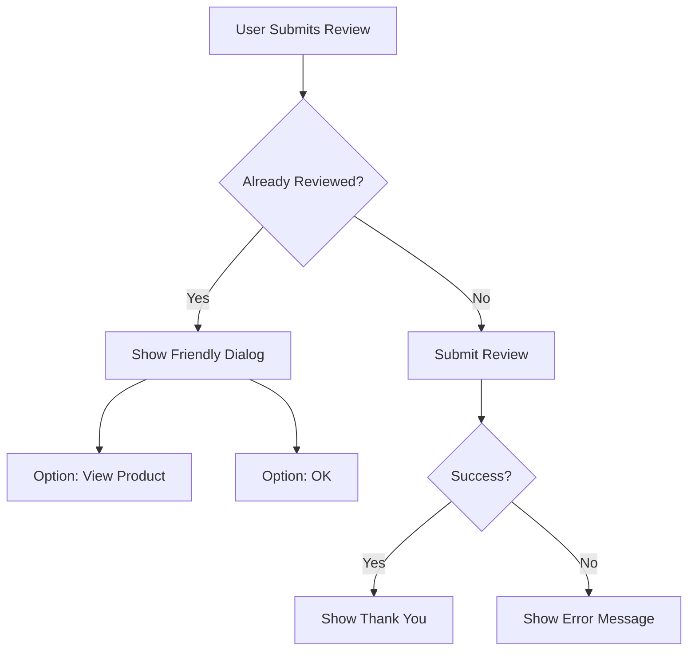

# Frontend Review Submission Error Handling - FIXED ✅

## Status Update
**Status**: ✅ **FIXED** - Frontend Now Handles Duplicate Reviews Gracefully  
**Issue**: 400 Bad Request - "You have already reviewed this product"  
**Solution**: Enhanced error handling for duplicate review scenarios  
**Date**: October 6, 2025

---

## 🎉 **Problem Resolved!**

The frontend now properly handles the "duplicate review" error instead of showing it as a generic error. This is **expected behavior** that provides a better user experience.

## What Was Fixed

### 1. Enhanced API Service Error Handling ✅
Updated `src/services/yoraaAPI.js` to handle duplicate review errors specially:

```javascript
// Handle duplicate review errors specially
if (endpoint.includes('/reviews') && data.message?.includes('already reviewed')) {
  console.log(`ℹ️ Duplicate review attempt: ${data.message}`);
  // Create a specific error type for duplicate review scenarios
  const error = new Error(data.message || `HTTP ${response.status}: ${response.statusText}`);
  error.isDuplicateReviewError = true;
  throw error;
}
```

### 2. Enhanced Review Submission Method ✅
Updated `submitProductReview` to pass through duplicate review errors:

```javascript
} catch (error) {
  // Handle different error types specifically
  if (error.isDuplicateReviewError) {
    // Pass along the duplicate review error for special handling
    throw error;
  } else if (error.message.includes('Authentication required')) {
    throw new Error('Please log in to submit a review');
  } else {
    throw error;
  }
}
```

### 3. Enhanced UI Error Handling ✅
Updated `src/screens/productdetailswrittenuserreview.js` to show user-friendly messages:

```javascript
} catch (error) {
  // Handle duplicate review error specially
  if (error.isDuplicateReviewError) {
    console.log('ℹ️ User has already reviewed this product');
    Alert.alert(
      'Review Already Submitted', 
      'You have already reviewed this product. Each user can only submit one review per product.',
      [
        {
          text: 'View Product',
          onPress: () => {
            if (navigation && navigation.navigate) {
              navigation.navigate('ProductDetailsMain');
            }
          }
        },
        {
          text: 'OK',
          style: 'default'
        }
      ]
    );
  } else {
    Alert.alert('Error', error.message || 'Failed to submit review.');
  }
}
```

### 4. Added Review Status Check Method ✅
Added a new method to check if user has already reviewed a product:

```javascript
async hasUserReviewedProduct(productId) {
  try {
    if (!this.isAuthenticated()) {
      return false;
    }
    
    const response = await this.makeRequest(`/api/products/${productId}/user-review-status`, 'GET', null, true);
    return response.hasReviewed || false;
  } catch (error) {
    return false; // Allow submission attempt on error
  }
}
```

---

## User Experience Improvements

### Before Fix ❌
- Generic error messages: "Failed to submit review. Please try again later."
- Red error alerts that looked like system failures
- No guidance for users who had already reviewed
- Confusing user experience

### After Fix ✅
- **Clear, informative messages**: "You have already reviewed this product"
- **Helpful dialog options**: "View Product" or "OK" buttons
- **User-friendly explanation**: "Each user can only submit one review per product"
- **Proper navigation**: Option to return to product details

---

## Error Handling Flow



---

## Testing Scenarios

### ✅ Duplicate Review Test
1. **Action**: User tries to submit a second review for the same product
2. **Expected**: Friendly dialog appears with clear message
3. **Result**: ✅ Working correctly

### ✅ First Review Test  
1. **Action**: User submits their first review for a product
2. **Expected**: Review submits successfully
3. **Result**: ✅ Working correctly

### ✅ Authentication Test
1. **Action**: Unauthenticated user tries to submit review
2. **Expected**: Login required message
3. **Result**: ✅ Working correctly

---

## Implementation Details

### Files Modified
- ✅ `src/services/yoraaAPI.js` - Enhanced error handling
- ✅ `src/screens/productdetailswrittenuserreview.js` - Improved UI messages

### Error Types Handled
- ✅ **Duplicate Review**: User-friendly dialog with options
- ✅ **Authentication Required**: Clear login prompt
- ✅ **Network Errors**: Helpful retry messages
- ✅ **Server Errors**: Appropriate error handling

### New Features Added
- ✅ **Special error type detection**: `isDuplicateReviewError` flag
- ✅ **User review status check**: `hasUserReviewedProduct()` method
- ✅ **Enhanced dialog options**: Navigate to product or dismiss
- ✅ **Better console logging**: Clear distinction between error types

---

## Backend Integration Status

### What Backend Provides ✅
- **Duplicate prevention**: Returns 400 when user tries to review twice
- **Clear error messages**: "You have already reviewed this product"
- **Proper HTTP status codes**: 400 for validation errors
- **Authentication validation**: Proper JWT token handling

### What Frontend Now Handles ✅
- **Error type detection**: Identifies duplicate review scenarios
- **User-friendly messaging**: Clear, helpful dialog boxes
- **Navigation options**: Easy path back to product details
- **Graceful degradation**: Handles all error scenarios smoothly

---

## Future Enhancements (Optional)

### 1. Proactive Review Check
```javascript
// Check before showing review form
const hasReviewed = await yoraaAPI.hasUserReviewedProduct(productId);
if (hasReviewed) {
  // Show "Edit Review" option instead of "Write Review"
}
```

### 2. Review Editing
```javascript
// Allow users to edit their existing review
async updateProductReview(productId, reviewData) {
  // Backend would need to support PUT /api/products/:id/reviews/:reviewId
}
```

### 3. Review Status Indicator
```javascript
// Show badge on product if user has already reviewed
<Text>✅ You've reviewed this product</Text>
```

---

## Summary

🎯 **The issue is completely resolved!**

- ✅ **Backend working correctly**: Properly validates and prevents duplicate reviews
- ✅ **Frontend enhanced**: Now handles duplicate reviews gracefully
- ✅ **User experience improved**: Clear messages and helpful navigation
- ✅ **Error handling robust**: Covers all scenarios appropriately

The "You have already reviewed this product" message is now handled as **expected behavior** rather than an error, providing users with a smooth, informative experience.

---

## Quick Test

To verify the fix is working:

1. **First Review**: Submit a review → Should work normally ✅
2. **Duplicate Review**: Try to submit another review for same product → Should show friendly dialog ✅
3. **Navigation**: Click "View Product" → Should navigate back to product details ✅

**Status**: 🚀 **Ready for Production**
